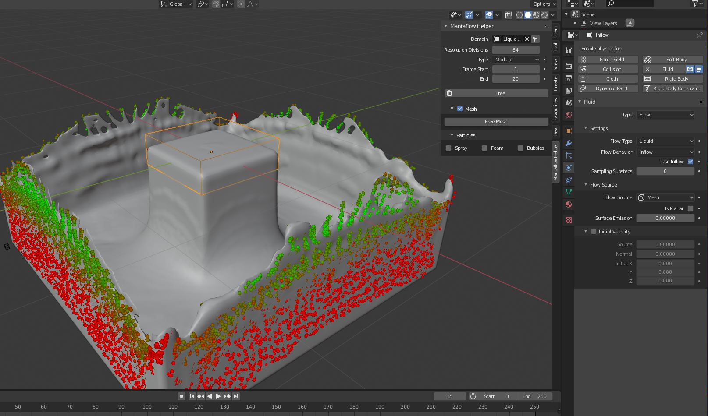

# Mantaflow-Helper

Adds a simplified interface to the 3D view right panel. Assign a domain for easy access, without needing to select it.
**--How to Install--**
* Click Clone or Download
* Download as Zip
* Open Blender, Preferences, Add-ons
* Install -> choose the zip file
